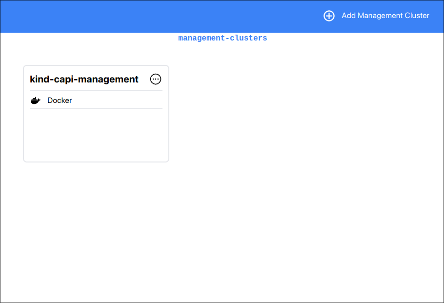
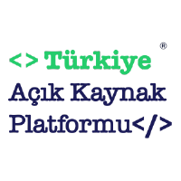

# KOS - Kubernetes Orchestration System

<p style="display: flex; align-items: center; flex-direction: column; gap: 10px;" align="center">
  
  <i>Screenshot of KOS Management Cluster screen</i>
</p>

## Introduction

KOS is a set of client/server utilities aimed at easing (multiple) Kubernetes cluster generation and management. It utilizes the [cluster-api](https://cluster-api.sigs.k8s.io/) project for this purpose and supports all of its provider backends (Currently only Docker is available).

It provides a UI via [electronjs](https://www.electronjs.org/).

## Requirements

KOS requires a proper management cluster (formed using [cluster-api](https://cluster-api.sigs.k8s.io/)). You can create one by following the [Quick Start](https://cluster-api.sigs.k8s.io/user/quick-start) guide.

See [cluster-api concepts](https://cluster-api.sigs.k8s.io/user/concepts.html) and related documentation.

You just need to provide a [kubeconfig](https://kubernetes.io/docs/concepts/configuration/organize-cluster-access-kubeconfig/) (with proper permissions) for this cluster to KOS. Then you will be able to create and delete clusters by using the UI.

## Supported providers

-   [x] Docker
-   [ ] GCP
-   [ ] AWS
-   [ ] Azure
-   [ ] Openstack

## Run from source

First of all you have to install dependencies with your package manager (`yarn`, `npm` or `pnpm`);

```shell
yarn install
```

Then run the `start` script;

```shell
yarn start
```

## Contributing

We could use a little help! According to our current roadmap, we aim to complete the desktop application using TypeScript/React/Electronjs. In this process, you can provide support in different areas such as translation, design, debug, testing, adding new features. You can join our Discord server for more information; https://discord.gg/mVd4ExHzFB

## Supporters

The following institutions and organizations support the development of the KOS project in various ways.

| Logo                                                 | Name                        | Support                                             |
| ---------------------------------------------------- | --------------------------- | --------------------------------------------------- |
|  | Turkey Open Source Platform | Providing support for access to AWS cloud services. |
